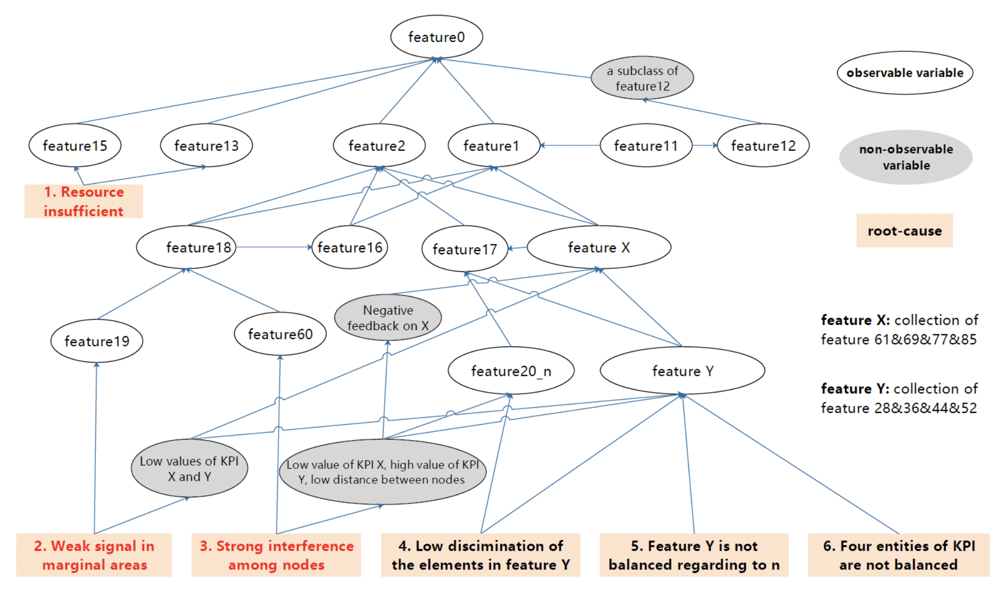

# 赛题描述
[icassp2022](https://www.aiops.sribd.cn/home/introduction)
## 因果关系

电信网络中feature0值偏低一直是客户关注的问题，本赛题重点解决feature0值偏低的根因定位问题。在已知其值小于200的情况下，我们需要通过分析feature0的影响因素，从而得到其值偏低的原因。feature0的影响关系如下图所示，每一个feature可以理解为电信网络中的一个关键绩效指标（KPI），这些KPI的取值随时间变化且相互影响。因此，需要通过图中提供的影响关系，推理出feature0值偏低的最终原因。

图中的椭圆形表示变量，其中无颜色表示可以采集观测到的数据，灰颜色表示中间计算变量（不可观测），方框表示对根因的描述。最上层feature0表示用户关心的结果变量。此关系图不随时间、地点位置发生改变，属于标准的通信协议关系。

变量之间的关系大多为非线性关系。有的是确定性关系，有的为概率性关系。

## 数据描述

## 评价指标

# 成绩
- Fold 1
  
- Fold 2
  
- Fold 3
  
- Fold 4
  
- Fold 5
  
- 最终线上成绩
  
